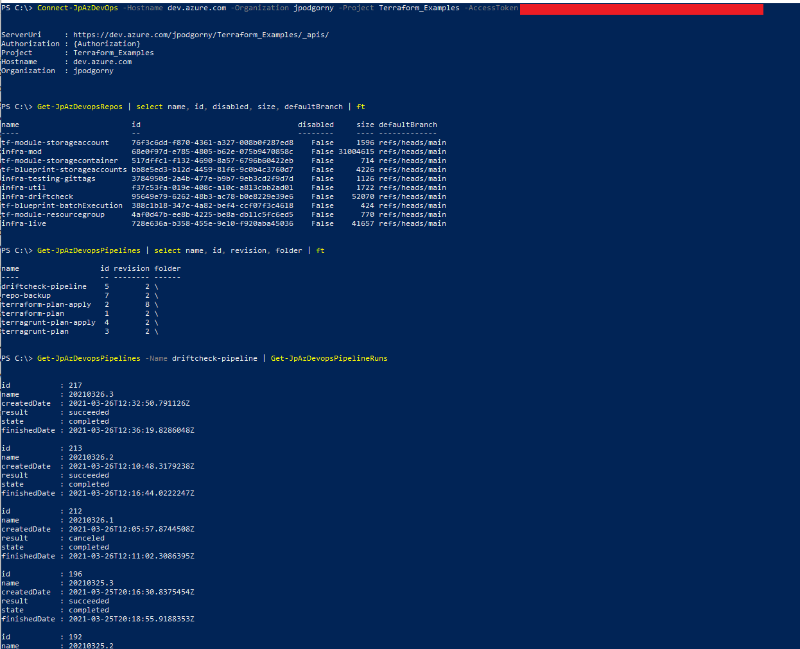

# JP_AzDevopsRest_Powershell
Powershell Module For Managing Azure Devops Via REST Calls.   Extremely fast.   Can be expanded quickly.   Azure DevOps has lots of cool options that are available in REST.

Only have a few functions currently, will be adding a lot more but this is initial commit starter.

This module also serves as a great starting point for any REST oriented Powershell modules, and could be repurposed with the calls to Azure DevOps being replaced with calls to any REST based endpoint.

NSX Powershell Module was used as a starting point.   That repo has a Control Script that has some usage examples, including feeding passwords using get credentials.   Obviously you'll want to consider how you input the access token and don't do it on the command line like this when someone is staring over your shoulder, or recording you screen or that sort of thing.    Unless you don't care about security, then do what you want.

Some Other Usage Examples In Quick Screens Below:

1. ##### Connect To Azure DevOps, List Git Repos

2. ##### List Pipelines, List Single Pipeline And Get Runs Against It (Takes Pipeline Input, Id Can Be Used)

